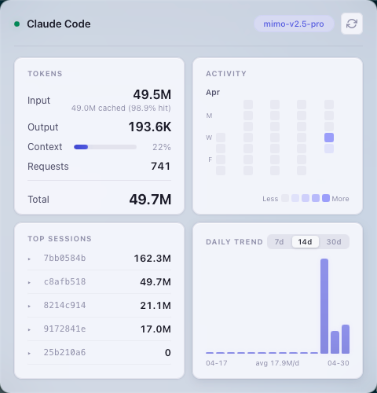

# Claude Token Monitor

A lightweight macOS menu bar app that monitors your Claude Code token usage in real time.

## Features

- **Real-time token tracking** — Input, output, cache read/write tokens displayed in a clean panel
- **Context usage indicator** — Visual bar showing how much of the context window you've used
- **Activity heatmap** — GitHub-style calendar heatmap of daily token usage
- **Top sessions** — Breakdown of token usage per session with expandable details
- **Daily trend chart** — Bar chart showing token consumption over 7/14/30 days
- **Dynamic tray icon** — Icon changes based on context usage level (low/medium/high)
- **Theme support** — Default and Liquid Glass (macOS vibrancy) themes
- **Config persistence** — Theme preference saved to `~/Library/Application Support/...`

## Screenshot



## Installation

### Download

Download the latest `.dmg` from [Releases](https://github.com/ggssh/claude-token-monitor/releases/latest).

### Build from source

**Prerequisites:**

- [Rust](https://rustup.rs/) (stable)
- macOS (primary target)

**Steps:**

```bash
git clone https://github.com/ggssh/claude-token-monitor.git
cd claude-token-monitor
cargo build --release -p token-monitor
```

The binary will be at `target/release/token-monitor`.

### Development

**Prerequisites:**

- [Tauri CLI](https://v2.tauri.app/start/prerequisites/): `cargo install tauri-cli`

```bash
# Start dev server with hot reload
cargo tauri dev
```

## How it works

Claude Code stores session data as JSONL files in `~/.claude/projects/<project>/<session-id>.jsonl`. This app:

1. Scans for session files at startup
2. Watches the projects directory for changes using filesystem events
3. Parses token usage from the `assistant` message entries
4. Displays aggregated stats in a tray panel

## Project structure

```
├── src/                    # Frontend (vanilla JS)
│   ├── index.html
│   ├── main.js             # IPC, state, polling
│   ├── render.js           # Heatmap, trend, sessions rendering
│   ├── theme.js            # Theme management
│   ├── utils.js            # Formatting helpers
│   └── styles.css
├── src-tauri/              # Rust backend
│   ├── src/
│   │   ├── lib.rs          # App setup, tray, window management
│   │   ├── commands.rs     # IPC command handlers
│   │   ├── config.rs       # Config file persistence
│   │   └── token_monitor.rs # JSONL parsing, file watching
│   ├── Cargo.toml
│   └── tauri.conf.json
└── scripts/                # Icon generation utilities
```

## Configuration

Config file location: `~/Library/Application Support/com.ggssh.claude-token-monitor/config/config.json`

Currently stores theme preference. The config directory is created automatically on first launch.

## License

[MIT](LICENSE)
